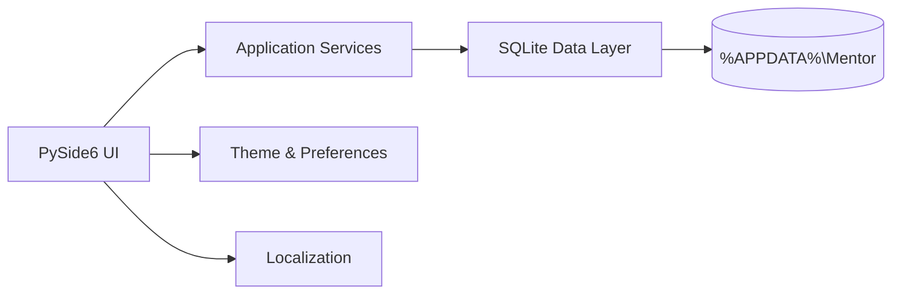

<div align="center">

# ✦ MENTOR

### A local-first teaching workspace for Windows

Plan lessons. Track students. Manage assignments. Keep notes and materials organized — without a cloud backend.


**Current release: Mentor 1.4 — Global & Personal**

[Features](#features) · [Quick Start](#quick-start) · [Architecture](#architecture) · [Release History](#release-history) · [Documentation](#documentation)

</div>

---

## Overview

**Mentor** is a desktop productivity and teaching-management application for teachers, tutors, mentors, and private instructors. It combines scheduling, student tracking, attendance, homework, notes, materials, tasks, goals, statistics, search, backup tools, localization, and personalization in one coherent Windows application.

The project is intentionally **local-first**: the core application works without a web server, cloud database, browser runtime, or paid API. Application-owned data is stored in SQLite under the current Windows user's application-data directory.

Mentor's interface uses a restrained dark visual system with a floating bottom dock, subtle glass treatment, compact typography, and configurable accents. There is **no permanent sidebar**.

## Features

| Area | Capabilities |
| --- | --- |
| **Home** | Daily overview, live statistics, today's lessons, recent activity, quick actions, goals, due-work indicators |
| **Schedule** | Day/week views, lesson CRUD, recurrence, conflict warnings, templates, recurring-series controls |
| **Students** | Searchable records, detailed profiles, teaching history, attendance and linked learning data |
| **Attendance** | Present, Late, Absent, Excused and Not marked states, summarized per student |
| **Assignments** | Homework with due dates, student/lesson/material links, completion state and score/result |
| **Lesson workflow** | Lesson details, completion flow, attendance, notes and optional homework wrap-up |
| **Notes** | Create/edit/delete, tags, pinning, archive, student/session/subject linking |
| **Materials** | Local file/URL references, categories, drag-and-drop, open/reveal, missing-file handling |
| **Tasks & Goals** | Priorities, due dates, progress tracking and relationships |
| **Statistics** | Teaching hours, completed sessions, student activity, attendance and assignments |
| **Search** | Global `Ctrl+K` search across major entities |
| **Data safety** | SQLite persistence, backup/restore, JSON/CSV export, schema migrations |
| **Localization** | English, Uzbek (Latin), Russian and localized date/time behavior |
| **Personalization** | Accent, glass intensity, motion, density, glow, 12/24-hour time and week start |

## Product principles

- **Useful before decorative** — visible controls should perform real actions.
- **Local-first by default** — core teaching data does not require cloud infrastructure.
- **Data survives upgrades** — migrations are versioned and user data is kept outside the source directory.
- **Desktop-native interaction** — keyboard shortcuts, context actions, local files and Windows packaging are first-class.
- **Calm visual hierarchy** — layered dark surfaces, restrained accent usage and subtle animation.
- **One coherent workflow** — schedule → lesson → attendance → notes → homework → student history → statistics.

## Download

### Windows installer — recommended

Download **[MentorSetup.exe](https://github.com/InomjonovaYoqutoy/Mentor/releases/download/v1.4.0/MentorSetup.exe)** from the latest release.

The installer places Mentor under your Windows user profile, adds a Start Menu shortcut, optionally creates a desktop shortcut, and includes a standard uninstaller. Python is **not** required on the target computer.

A portable build is also available as **[Mentor-portable-windows.zip](https://github.com/InomjonovaYoqutoy/Mentor/releases/download/v1.4.0/Mentor-portable-windows.zip)**.

SHA-256 hashes are published in **[SHA256SUMS.txt](https://github.com/InomjonovaYoqutoy/Mentor/releases/download/v1.4.0/SHA256SUMS.txt)**.

> The current Windows installer is not code-signed, so Microsoft Defender SmartScreen may show an “Unknown publisher” warning on first launch.

## Quick start

### Requirements for running from source

- Windows 10 or Windows 11
- Python 3.12+

### Run from source

```bat
python -m pip install -r requirements.txt
python main.py
```

Or:

```bat
run.bat
```

### Run the quality suite

```bat
quality_check.bat
```

### Build Windows packages locally

Build the portable application folder:

```bat
build_exe.bat
```

Build a proper installer (requires Inno Setup 6):

```bat
build_installer.bat
```

Outputs:

```text
dist\Mentor\Mentor.exe
dist\installer\MentorSetup.exe
```

## Architecture



The codebase separates UI, data access, services, theme/preferences, localization and application infrastructure instead of placing the application in one monolithic file.

## Data model

Current database schema: **v4**.

Primary entities:

`students` · `sessions` · `notes` · `materials` · `tasks` · `assignments` · `lesson_templates` · `goals` · `activity` · `settings`

SQLite foreign keys are enabled and schema upgrades are handled through migrations.

## Languages & personalization

Mentor 1.4 supports **English**, **O‘zbekcha (Latin)**, and **Русский**. Regional preferences include 12/24-hour time, Monday/Sunday week start and Day/Week schedule defaults. Appearance preferences include Orange, Amber, Graphite, Blue and Violet accents, glass intensity, motion level, interface density and atmospheric glow.

Persisted enum values remain canonical internally and are translated only at the UI boundary, so changing languages does not rewrite stored lesson, attendance or assignment states.

## Data & privacy

Mentor does not require a cloud backend. Application-owned data lives under:

```text
%APPDATA%\Mentor\
```

Teaching material files are referenced by path rather than copied into the database.

## Quality & testing

Mentor includes Python compilation checks, database/service regression tests, source regressions and Qt offscreen runtime smoke tests when PySide6 is available.

Recorded Mentor 1.4 build-environment result: **40 tests discovered, 33 passed, 0 failed, 0 errors, 7 skipped**. The skipped cases were Qt runtime tests because PySide6 was unavailable in that build environment; the tests remain included for Windows/CI execution.

## Release history

| Version | Release | Focus |
| --- | --- | --- |
| **1.4.0** | **Global & Personal** | EN/UZ/RU localization, regional settings, personalization, Settings redesign |
| **1.3.0** | **Lessons & Assignments** | Homework, lesson detail workspace, wrap-up flow, templates, series controls |
| **1.2.0** | **Student Intelligence** | Student profiles, attendance and student-centric workflows |
| **1.1.1** | **Quality Hotfix** | Scheduling regression fix, Notes cleanup, dock/quick-create polish, QA |
| **1.1.0** | **Glass & Lessons** | Lesson editor expansion, schedule improvements, focus timer and visual polish |
| **0.9.0** | **First Functional Build** | Local-first foundation and complete first-pass workspace |

There was no formal `1.0.0` release; development moved from `0.9.0` directly to `1.1.0`.

## Keyboard shortcuts

| Shortcut | Action |
| --- | --- |
| `Ctrl + K` | Global search |
| `Ctrl + N` | Contextual new item |
| `Ctrl + S` | Save in supported editors |
| `Esc` | Close active overlay/dialog where supported |
| `1`–`5` | Home / Schedule / Notes / Materials / Statistics |

## Documentation

- [Project Overview](docs/PROJECT_OVERVIEW.md)
- [Architecture](docs/ARCHITECTURE.md)
- [Release History](docs/RELEASES.md)
- [Testing & QA](docs/TESTING.md)
- [Localization](docs/LOCALIZATION.md)
- [Data & Privacy](docs/DATA_AND_PRIVACY.md)
- [University Demo Guide](docs/DEMO_GUIDE.md)
- [Roadmap](docs/ROADMAP.md)
- [Changelog](CHANGELOG.md)
- [Contributing](CONTRIBUTING.md)
- [Security](SECURITY.md)

---

<div align="center">

**MENTOR** — *Your teaching, organized.*

</div>