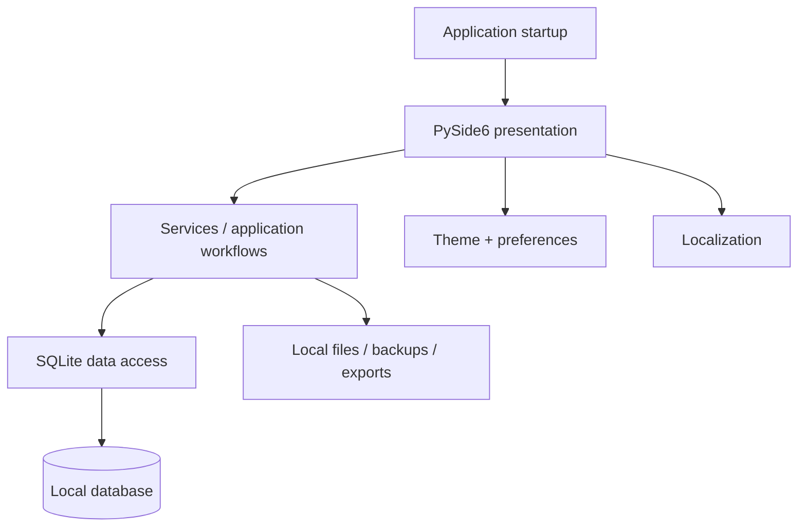
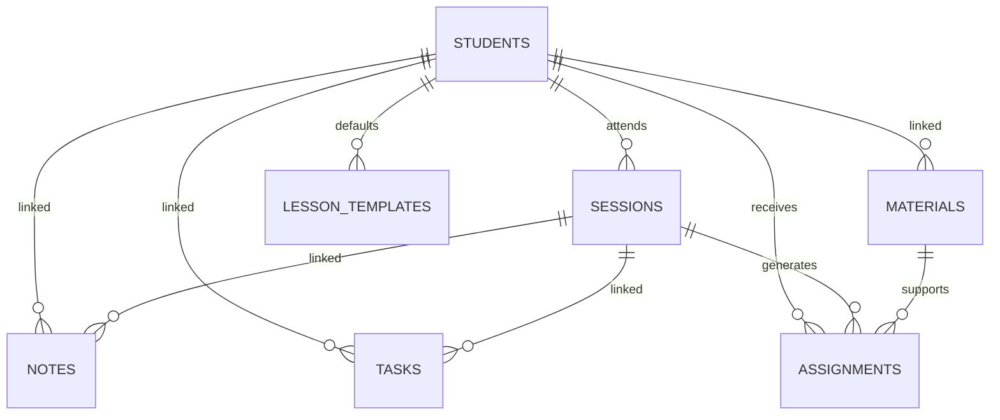

# Architecture

## High-level design



## Modules

### `mentor/core/`
Shared infrastructure such as Windows-friendly paths and logging.

### `mentor/database/`
SQLite schema, initialization, migrations, connection behavior, and transactional queries.

### `mentor/services/`
Application-level data operations used by the UI.

### `mentor/ui/`
Main window, reusable widgets, dialogs, Student Profile, Lesson Details, and primary pages.

### `mentor/theme/`
Design tokens, stylesheet generation, and persisted appearance preferences.

### `mentor/i18n.py`
Central translation catalog and formatting helpers for English, Uzbek, and Russian.

## Startup sequence

1. Resolve per-user application paths.
2. Configure logging.
3. Open/initialize SQLite.
4. Run migrations when needed.
5. Load settings and appearance preferences.
6. Create the Qt application and main window.
7. Load the active page and user data.

## Database

Current schema version: **4**.



| Table | Purpose |
| --- | --- |
| `students` | Learner identity, grade/subject, contact, notes, status |
| `sessions` | Lessons, date/time, status, recurrence, attendance, reminders, series |
| `notes` | Teaching notes linked optionally to student/session/subject |
| `materials` | References to local teaching resources |
| `tasks` | Lightweight teacher tasks |
| `assignments` | Student homework with due date, status, score, links |
| `lesson_templates` | Reusable lesson creation defaults |
| `goals` | Target/progress/deadline tracking |
| `activity` | Recent significant events |
| `settings` | User/application preferences |
| `app_metadata` | Internal metadata such as schema version |

Most optional foreign keys use `ON DELETE SET NULL`, preserving historical records instead of cascading deletion.

Indexes cover common filters such as session date/student, task/assignment due dates, note update time, material category, and activity timestamp.

## Local storage

Application-owned data is stored separately from source code under the Windows per-user Mentor application-data directory, conceptually:

```text
%APPDATA%\Mentor\
```

## Migration strategy

The schema version is stored in `app_metadata`. Older databases are upgraded in place.

- v3 introduced persistent lesson attendance.
- v4 introduced assignments, lesson templates, and recurring-series identity.

## Navigation

Primary navigation uses a floating five-section dock:

1. Home
2. Schedule
3. Notes
4. Materials
5. Statistics

Student Profile, Lesson Details, Homework, Tasks, Goals, Search, and Settings are secondary focused workflows.

## Localization

Persisted enums remain canonical (for example `Completed`, `Present`, `Assigned`). Translation occurs at the presentation boundary so changing language cannot rewrite business-state values.

## Packaging

`build_exe.bat` invokes PyInstaller in windowed one-folder mode. Runtime paths are resolved independently of the source/executable directory so packaged and source execution share the same persistent data location.
